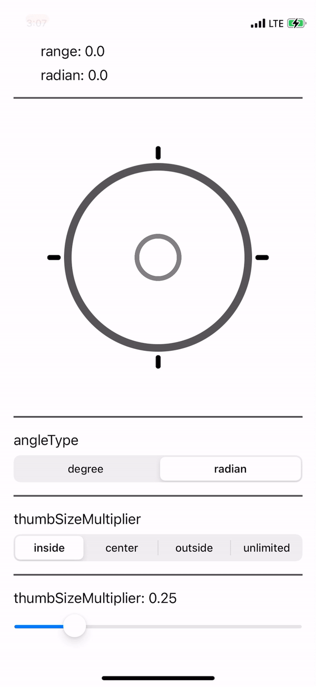

# JCJoystick

[](https://travis-ci.org/JoongChangYang/JCJoystick)
[](https://cocoapods.org/pods/JCJoystick)
[](https://cocoapods.org/pods/JCJoystick)
[](https://cocoapods.org/pods/JCJoystick)

## Example

To run the example project, clone the repo, and run `pod install` from the Example directory first.

## Requirements

## Installation

JCJoystick is available through [CocoaPods](https://cocoapods.org). To install
it, simply add the following line to your Podfile:

```ruby
pod 'JCJoystick'
```

## Preview



## Usage

### Basic

``` swift
let joystickView = JCJoystickView()
joystickView.delegate = self
```

### Delegate

``` swift
public protocol JCJoystickViewDelegate: AnyObject {
    func joystickView(joystickView: JCJoystickView, shouldDrag value: JCJoystickValue) -> Bool
    func joystickView(joystickView: JCJoystickView, beganDrag value: JCJoystickValue)
    func joystickView(joystickView: JCJoystickView, didDrag value: JCJoystickValue)
    func joystickView(joystickView: JCJoystickView, didEndDrag value: JCJoystickValue)
}
```

### Options

- image

  ``` swift
  let joystickView = JCJoystickView()
  joystickView.boundaryImage = <yourImage>
  joystickView.thumbImage = <yourImage>
  ```

- angleValueType

  ``` swift
  let joystickView = JCJoystickView()
  joystickView.angleValueType = .degree
  // or
  joystickView.angleValueType = .radian
  ```

- thumbLimitStyle

  ``` swift
  let joystickView = JCJoystickView()
  joystickView.thumbLimitStyle = .inside
  //or
  joystickView.thumbLimitStyle = .center
  //or
  joystickView.thumbLimitStyle = .outside
  //or
  joystickView.thumbLimitStyle = .unlimited
  //or
  joystickView.thumbLimitStyle = .customWithConstant(constant: 20)
  //or
  joystickView.thumbLimitStyle = .customWithMultiplier(multiplier: 1.5)
  ```

- thumbSizeMultiplier

  ``` swift
  let joystickView = JCJoystickView()
  self.joystickView.thumbSizeMultiplier = 0.25
  ```

## Author

JoongChangYang, didwndckd@gmail.com

## License

JCJoystick is available under the MIT license. See the LICENSE file for more info.
